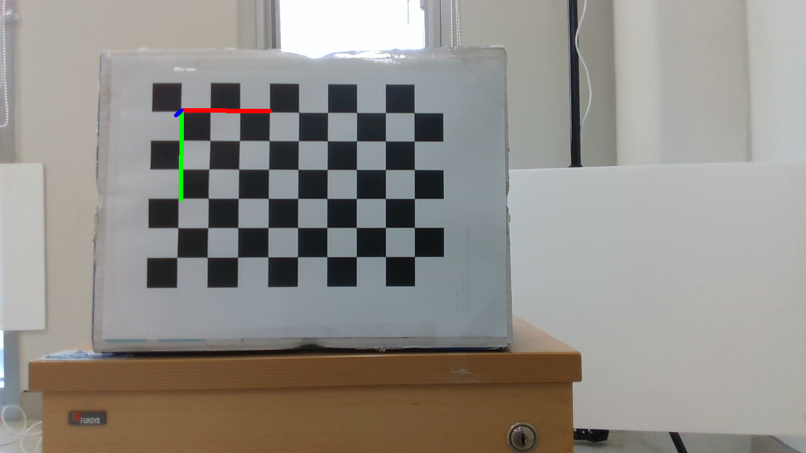

# Chessboard and aruco marker tracking

# Pose estimation through checker board marker

First of all, calibrate the D435i camera through opencv.

When you get the camera matrix and distortion coefficients, plug them into the matrix.

Necessary Device: D435i, pxhawk4

Topic Subscribe to /mavros/imu/mag and /camera/color/image_raw

Precision: within 2 mm
